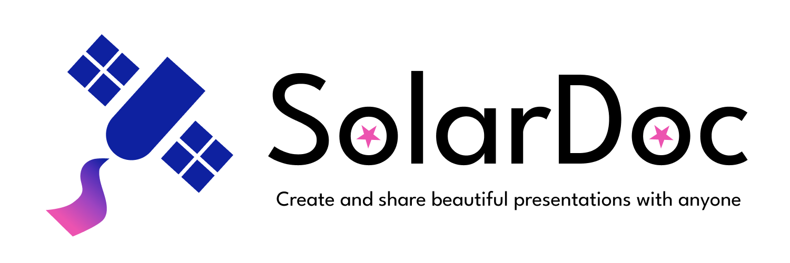

= SolarDoc 🌌✨

SolarDoc is a dynamic online editor which allows you to create beautiful presentations using AsciiDoc in your browser. Collaborate with your colleagues and friends in the online editor and freely share your work with anyone! 

== Problem & Background 🛑

=== Given Situation ⚡

There is no collaborative environment for creating presentations using AsciiDoc. As such, it is difficult to efficiently develop presentations. Currently, there are tools & plugins available to render real-time AsciiDoc and AsciiDoc presentations using revael.js, but they either lack functionality or require monthly license payments. As such they are unsuitable for students and teachers given the college environment. 

=== Potential for improvement 💡

- Better code editor for writing AsciiDoc
- Better UI for viewing presentation slides and nested slides
- Ability to easily work collaboratively on presentations
- More accessibility for students and teachers
- Ability to share files with anyone using share links

== Goals 📈

To allow students and teachers to more efficiently create, edit and share presentations. They should be able to easily work together and have a co-working space, where they can manage an entire presentation without the need for external tools. The editor should be performant and responsive, without having to worry too much about rendering time.

== Potential & Risks ⚠️

- Conversion pipeline is too performance-heavy slowing down the browser of the user/client. (AsciiDoc -> Presentation)
- The complexity of creating a presentation might get out of hand with big and detailed presentations.

== Roadmap & Planning 🛣️

The user stories and goals for the project are listed here in the https://github.com/SYP-AHIF-2023-24-25/SolarDoc/discussions?discussions_q=is%3Aopen+label%3A%22user+story%22[discussions page].

=== Planned Roadmap

- Editor and Preview (https://github.com/SYP-AHIF-2023-24-25/SolarDoc/discussions/3 & https://github.com/SYP-AHIF-2023-24-25/SolarDoc/discussions/4) 
- ...
- ...
- ...
- ...
- ...
